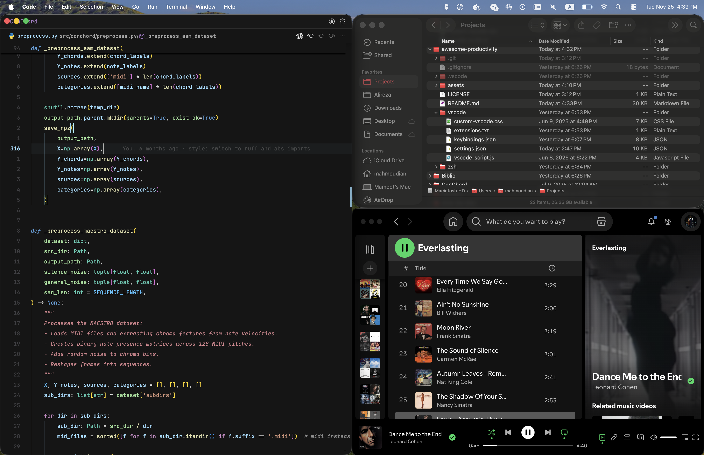
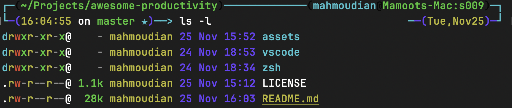
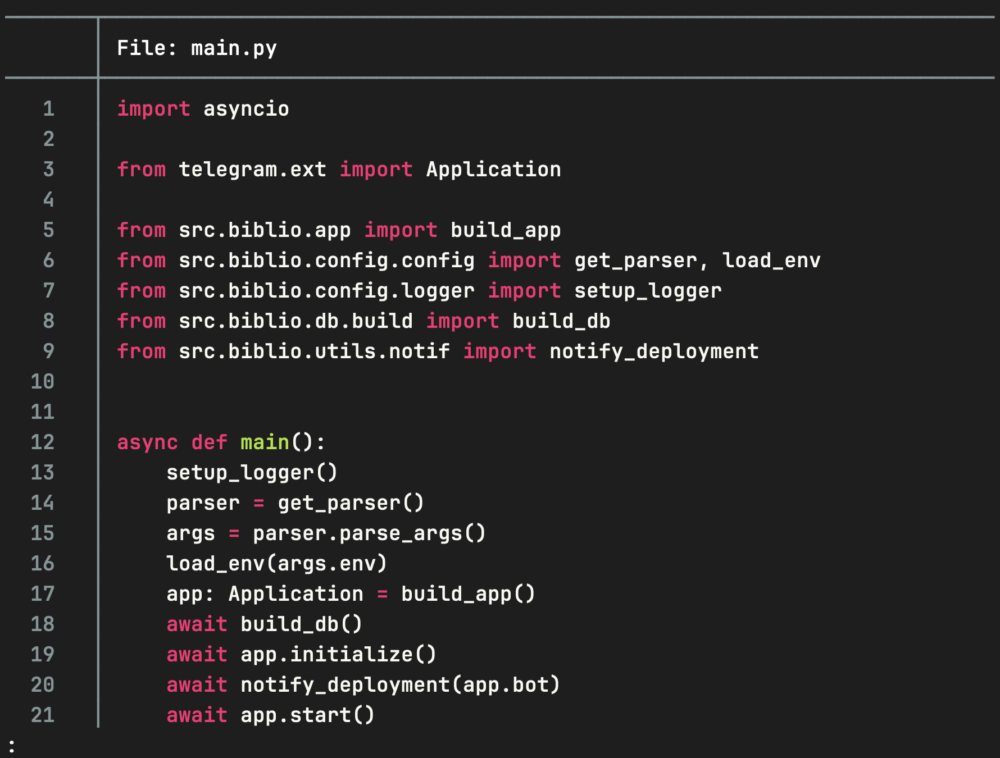
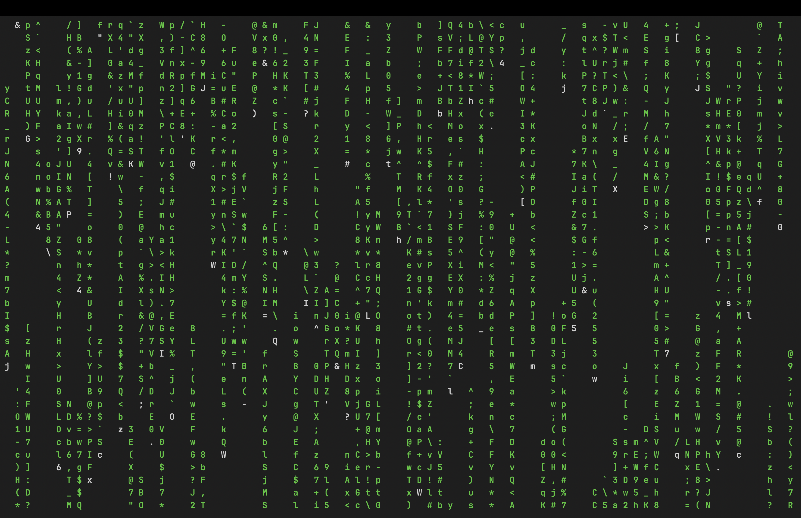
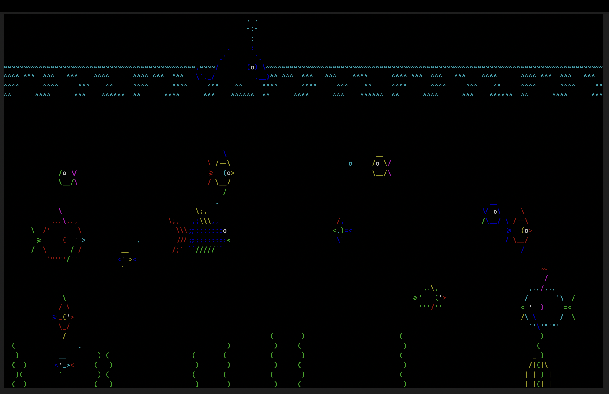
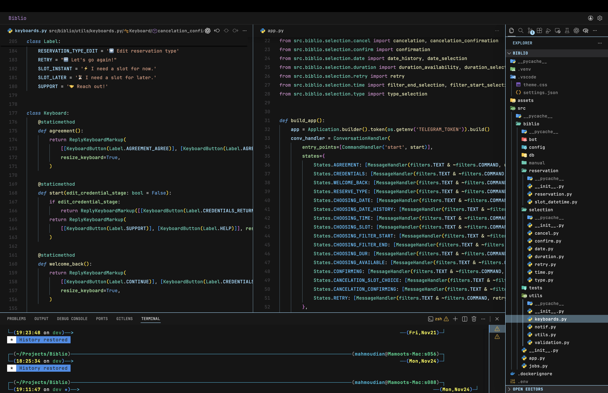
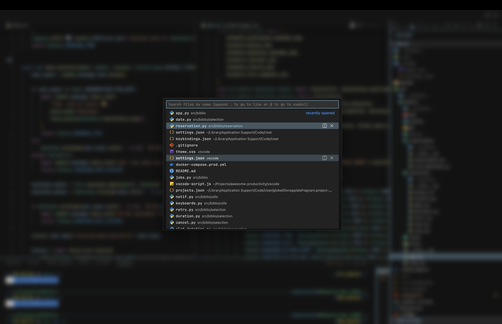

# Overview

This repository serves as a lightweight, portable setup for productivity tooling, editor configuration, terminal customizations, and workflow improvements.

You can manually copy the contents of these files into your own configuration files,  
but a much better approach is to **clone this repository** and use **GNU Stow** to create symlinks between the files here and their corresponding system paths.

This keeps all of your settings centralized in one place:  
you edit the files in this repo, and the changes are instantly reflected in the actual configuration paths on your system.  
It also makes it easy to track, version, and sync your entire setup.

### 1. Install Stow

**macOS**

```bash
brew install stow
```

**Linux (Debian/Ubuntu)**

```bash
sudo apt install stow
```

### 2. Clone this repo

```bash
git clone https://github.com/TheRealMamoot/awesome-productivity
cd awesome-productivity
```

### 3. Link a package

Example for **VSCode settings**:

```bash
stow --adopt -t "$HOME/Library/Application Support/Code/User" vscode
```

or **Oh-My-Zsh aliases**:

```bash
stow --adopt -t "$HOME/.oh-my-zsh/custom" zsh
```

### 4. Done!

The files in this repo are now symlinked to your system paths —
edit them here, and your system updates instantly!

# Raycast

Raycast is the command palette your Mac secretly wishes it had.  
It replaces Spotlight with something faster, smarter, and actually useful. You can extend it with all kinds of powerful extensions like GitHub, Spotify, Jira, Notion, Brew, Clipboard History, etc.

The two features that pull the most weight are **Window Management** and **Shortcuts**.
Shortcuts give you instant access to quick actions, while Window Management makes navigating macOS feel frictionless. Together they replace half a dozen separate apps and keep everything fast, clean, and keyboard-first.

## Window Management

Below are some of the keybindings I use for window tiling. They’re especially useful if you’re working without a second monitor.

You can configure these commands under the **Window Management** extension tab.

<div align="center">

| Command           | Shortcut |
| ----------------- | -------- |
| Toggle Fullscreen | ⌃ ⌥ ⌘ F  |
| Left Half         | ⌃ ⌥ ⌘ [  |
| Right Half        | ⌃ ⌥ ⌘ ]  |
| Make Larger       | ⌃ ⌥ ⌘ =  |
| Make Smaller      | ⌃ ⌥ ⌘ -  |
| Maximize          | ⌃ ⌥ ⌘ M  |
| Maximize Height   | ⌃ ⌥ ⌘ ↩︎ |
| Maximize Width    | ⌃ ⌥ ⌘ ⟷  |
| Move Down         | ⌃ ⌥ ⌘ ↓  |
| Move Left         | ⌃ ⌥ ⌘ ←  |
| Move Right        | ⌃ ⌥ ⌘ →  |
| Move Up           | ⌃ ⌥ ⌘ ↑  |
| Reasonable Size   | ⌃ ⌥ ⌘ '  |
| Restore           | ⌃ ⌥ ⌘ R  |

<br>
</div>

<p align="center">
  
  <br>
  <em>With only the keyboard</em>
</p>

## Shortcuts

Here are some of the shortcuts I rely on and their corresponding tabs in Raycast's _extension_ section:

<div align="center">

| Name (Tab)                              | Shortcut |
| --------------------------------------- | -------- |
| _Open Terminal_ (Applications)          | ⌘ ~      |
| _Open VSCode_ (Applications)            | ⌘ 2      |
| _Open Chrome_ (Applications)            | ⌘ 3      |
| _Open Spotify_ (Applications)           | ⌘ 4      |
| _Open Telegram/Whatsapp_ (Applications) | ⌘ 5      |
| Clipboard History (Clipboard History)   | ⌃ ⌥ ⌘ C  |
| Lock Screen (System)                    | ⌃ L      |
| Show Desktop (System)                   | ⌃ ⌥ ⌘ D  |
| Next Track (Spotify)                    | ⌘ 0      |
| Toggle Play/Pause (Spotify)             | ⌘ 9      |
| Previous Track (Spotify)                | ⌘ 8      |
| Skip Forward (Spotify)                  | ⌘ ⇧ 0    |
| Skip Backward (Spotify)                 | ⌘ ⇧ 8    |
| Toggle Repeat (Spotify)                 | ⌃ ⌥ ⌘ 0  |
| Toggle Shuffle (Spotify)                | ⌃ ⌥ ⌘ 8  |

<br>
</div>

### ❗**Important❗**

When configuring custom shortcuts, be aware that some key combinations may already be reserved by macOS or existing applications. You may need to disable or remap certain system-level shortcuts to avoid conflicts.  
Additionally, some of these keybindings can overlap with default or recommended VSCode shortcuts, so adjusting one environment might require updating the other as well.

# Terminal

**Oh My Zsh** comes preinstalled on macOS, while Linux users may need to install Zsh manually before running the Oh My Zsh installer. Installing it generates the main `~/.zshrc` file and sets up the shell framework.  
This setup uses the **[Jonathan Terminal theme](https://github.com/ohmyzsh/ohmyzsh/blob/master/themes/jonathan.zsh-theme)**. Complete instructions can be found **[here](https://github.com/ohmyzsh/ohmyzsh)**.

## CLI Essential Tools

- **[tree](https://formulae.brew.sh/formula/tree)** – Displays directory structures as an ASCII tree; useful for inspecting project layouts.

```txt
.
├── main.py
├── Makefile
├── pyproject.toml
├── README.md
├── requirements.txt
├── src
│   ├── __pycache__
│   │   ├── main.cpython-312.pyc
│   │   └── manual_request.cpython-312.pyc
│   └── biblio
│       ├── __init__.py
│       ├── __pycache__
│       ├── app.py
│       ├── config
│       ├── db
│       ├── jobs.py
│       ├── tests
│       └── utils
└── uv.lock

15 directories, 29 files
```

- **[eza](https://github.com/eza-community/eza)** – A modern replacement for `ls` with better formatting, icons, colors, and git-aware directory listings.

<p align="center">
  
</p>

- **[bat](https://github.com/sharkdp/bat)** – A modern replacement for `cat` with syntax highlighting and paging.

<p align="center">
  
</p>

- **[fzf](https://github.com/junegunn/fzf)** – Fast, fuzzy command-line finder used for searching files, directories, history, and more.
- **[stow](https://www.gnu.org/software/stow/)** – Symlink manager for organizing dotfiles and keeping configuration clean across machines.
- **[starship](https://starship.rs/)** – A fast, minimal, highly customizable shell prompt that works with Zsh, Bash, Fish, and more.

#### **Bonus:**

- **[cmatrix](https://github.com/abishekvashok/cmatrix)** – Terminal “Matrix rain” animation, recreating the iconic digital rain effect.
- **[asciiquarium](https://github.com/cmatsuoka/asciiquarium)** – Terminal-based aquarium animation rendered entirely in ASCII characters.

**_I personally go fullscreen with the terminal and use `caffeinate -d cmatrix` as a screensaver!_**

<p align="center">
  
  
</p>

## Custom Aliases

Custom aliases belong in:

```bash
~/.oh-my-zsh/custom/aliases.zsh
```

Your repo uses GNU Stow to symlink this file.
After editing your aliases file, reload Zsh:

```bash
source ~/.zshrc
```

Below is a list of useful aliases:

```zsh
alias python=python3
alias pip=pip3
alias ls='eza --group-directories-first'
alias ll='eza -lah --group-directories-first'
alias la='eza -la --group-directories-first'
alias cat='bat'
alias ga='git add'
alias gaa='git add -A'
alias gcm='git commit -m'
alias gca='git commit --amend --no-edit'
alias gp='git push'
alias gs='git status'
alias gss='git status -s'
alias gr='git reset'
alias cmd='caffeinate -d cmatrix'
alias sba='source .venv/bin/activate'
alias sbd='deactivate'
alias nrd='npm run dev'
alias c='clear'
```

# VSCode Configuration

## Extensions

### AI & Coding Assistance

- **[GitHub Copilot](https://marketplace.visualstudio.com/items?itemName=GitHub.copilot)** – AI code completion and smart suggestions.
- **[GitHub Copilot Chat](https://marketplace.visualstudio.com/items?itemName=GitHub.copilot-chat)** – Chat-based AI assistant inside VSCode.
- **[OpenAI Codex](https://marketplace.visualstudio.com/items?itemName=openai.chatgpt)** – ChatGPT integrated directly into the editor.

### Python & Data Science

- **[Pylance](https://marketplace.visualstudio.com/items?itemName=ms-python.vscode-pylance)** – Fast Python language server.
- **[Python Environments](https://marketplace.visualstudio.com/items?itemName=ms-python.vscode-python-envs)** – Environment management UI for Python.
- **[Python Debugger](https://marketplace.visualstudio.com/items?itemName=ms-python.debugpy)** – Python debugging engine.
- **[Jupyter](https://marketplace.visualstudio.com/items?itemName=ms-toolsai.jupyter)** – Jupyter notebook support.

### Formatters

- **[Ruff](https://marketplace.visualstudio.com/items?itemName=charliermarsh.ruff)** – Extremely fast Python linter & formatter.
- **[Prettier](https://marketplace.visualstudio.com/items?itemName=esbenp.prettier-vscode)** – Code formatter for JavaScript, TypeScript, JSON, Markdown, HTML, etc.

### Utilities

- **[Import Cost](https://marketplace.visualstudio.com/items?itemName=wix.vscode-import-cost)** – Shows size of imported JavaScript/TypeScript packages.
- **[Better Comments](https://marketplace.visualstudio.com/items?itemName=aaron-bond.better-comments)** – Highlight comments with tags and colors.
- **[Project Manager](https://marketplace.visualstudio.com/items?itemName=alefragnani.project-manager)** – Organize and quickly switch between projects.
- **[Markdown All in One](https://marketplace.visualstudio.com/items?itemName=yzhang.markdown-all-in-one)** – Enhances Markdown editing with shortcuts, TOC generation, formatting, and GitHub-style previews.
- **[Rainbow CSV](https://marketplace.visualstudio.com/items?itemName=mechatroner.rainbow-csv)** – Colorizes CSV columns.
- **[Code Spell Checker](https://marketplace.visualstudio.com/items?itemName=streetsidesoftware.code-spell-checker)** – Highlights spelling errors in code/text.

### Docker & Dev Containers

- **[Docker](https://marketplace.visualstudio.com/items?itemName=ms-azuretools.vscode-docker)** – Full Docker tooling support.
- **[Container Tools](https://marketplace.visualstudio.com/items?itemName=ms-azuretools.vscode-containers)** – Manage container registries and images.
- **[Dev Containers](https://marketplace.visualstudio.com/items?itemName=ms-vscode-remote.remote-containers)** – Open VSCode inside Docker containers.

### Development Tools

- **[GitLens](https://marketplace.visualstudio.com/items?itemName=eamodio.gitlens)** – Advanced Git history and insights.
- **[GitHub Actions](https://marketplace.visualstudio.com/items?itemName=github.vscode-github-actions)** – View and manage GitHub Actions workflows.
- **[Makefile Tools](https://marketplace.visualstudio.com/items?itemName=ms-vscode.makefile-tools)** – Makefile language and target integration.
- **[REST Client](https://marketplace.visualstudio.com/items?itemName=humao.rest-client)** – Send HTTP requests directly from VSCode.
- **[Multiple Cursor Case Preserve](https://marketplace.visualstudio.com/items?itemName=cardinal90.multi-cursor-case-preserve)** – Keeps case when editing multiple cursors.
- **[Live Server](https://marketplace.visualstudio.com/items?itemName=ritwickdey.liveserver)** – Local dev server with live reload.

### Themes, Icons & UI

- **[Material Icon Theme](https://marketplace.visualstudio.com/items?itemName=PKief.material-icon-theme)** – Clean Material-style file icons.
- **[VSCode-PDF](https://marketplace.visualstudio.com/items?itemName=tomoki1207.pdf)** – PDF viewer inside VSCode.
- **[Custom UI Style](https://marketplace.visualstudio.com/items?itemName=subframe7536.custom-ui-style)** – User interface customizations.
- **[Custom CSS & JS Loader](https://marketplace.visualstudio.com/items?itemName=be5invis.vscode-custom-css)** – Inject custom CSS for UI tweaks.

### R Programming Support

- **[R Extension](https://marketplace.visualstudio.com/items?itemName=reditorsupport.r)** – R language support.
- **[R Syntax](https://marketplace.visualstudio.com/items?itemName=reditorsupport.r-syntax)** – Improved R syntax highlighting.

### Extension package names

```txt
aaron-bond.better-comments
alefragnani.project-manager
amazonwebservices.codewhisperer-for-command-line-companion
atommaterial.a-file-icon-vscode
be5invis.vscode-custom-css
cardinal90.multi-cursor-case-preserve
charliermarsh.ruff
eamodio.gitlens
equinusocio.vsc-material-theme
esbenp.prettier-vscode
github.copilot
github.copilot-chat
github.vscode-github-actions
humao.rest-client
mechatroner.rainbow-csv
ms-azuretools.vscode-containers
ms-azuretools.vscode-docker
ms-python.debugpy
ms-python.python
ms-python.vscode-pylance
ms-python.vscode-python-envs
ms-toolsai.jupyter
ms-toolsai.jupyter-keymap
ms-toolsai.jupyter-renderers
ms-toolsai.vscode-jupyter-cell-tags
ms-toolsai.vscode-jupyter-slideshow
ms-vscode-remote.remote-containers
ms-vscode.makefile-tools
openai.chatgpt
pkief.material-icon-theme
reditorsupport.r
reditorsupport.r-syntax
ritwickdey.liveserver
streetsidesoftware.code-spell-checker
subframe7536.custom-ui-style
tal7aouy.icons
tomoki1207.pdf
vscode-icons-team.vscode-icons
wix.vscode-import-cost
```

## Theme

<p align="center">
  
  <br>
  <em>VSCode main interface with custom theme</em>
</p>

<p align="center">
  
  <br>
  <em>Command Palette with custom UI styling</em>
</p>

### Custom Theme Setup

To enable the custom UI theme shown above, you need to install the following extension:

**[Custom CSS & JS Loader](https://marketplace.visualstudio.com/items?itemName=be5invis.vscode-custom-css)** – Inject custom CSS and JavaScript for UI tweaks.

After installing the extension, be sure to change the following configuration by replacing `<path-to-this-repo>` with the **full absolute path** where you cloned the repo
in `settings.json`.

```json
"vscode_custom_css.imports": [
  "file:///<path-to-this-repo>/vscode/theme/custom-vscode.css",
  "file:///<path-to-this-repo>/vscode/theme/vscode-script.js"
],
```

For a complete tutorial you can check **[this video](https://www.youtube.com/watch?v=9_I0bySQoCs&t=735s)**.

## Settings

```json
{
  // == Editor Settings ==
  "editor.accessibilitySupport": "off",
  "editor.bracketPairColorization.enabled": true,
  "editor.cursorBlinking": "expand",
  "editor.cursorSmoothCaretAnimation": "on",
  "editor.cursorStyle": "line",
  "editor.codeActionsOnSave": {
    "source.organizeImports": "explicit"
  },
  "editor.emptySelectionClipboard": false,
  "editor.fontFamily": "JetBrains Mono",
  "editor.fontLigatures": true,
  "editor.fontSize": 13,
  "editor.fontWeight": "500",
  "editor.formatOnSave": true,
  "editor.formatOnSaveMode": "file",
  "editor.guides.indentation": true,
  "editor.hideCursorInOverviewRuler": true,
  "editor.lightbulb.enabled": "off",
  "editor.lineHeight": 1.9,
  "editor.lineNumbers": "relative",
  "editor.letterSpacing": 0.2,
  "editor.minimap.enabled": false,
  // "editor.minimap.autohide": true,
  // "editor.minimap.maxColumn": 80,
  // "editor.minimap.size": "proportional",
  "editor.occurrencesHighlight": "off",
  "editor.overviewRulerBorder": false,
  "editor.renderWhitespace": "none",
  "editor.renderLineHighlightOnlyWhenFocus": true,
  "editor.rulers": [120],
  "editor.smoothScrolling": true,
  "editor.stickyScroll.enabled": true,
  "editor.wordWrap": "wordWrapColumn",
  "editor.wordWrapColumn": 120,
  // == Python Specific Settings ==
  "[python]": {
    "editor.codeActionsOnSave": {
      "source.organizeImports": "explicit"
    }
  },
  // == Semantic Token Colors ==
  "editor.semanticTokenColorCustomizations": {
    "rules": {
      "parameter": {
        "foreground": "#aaf0a5eb"
        // "fontStyle": "italic"
      }
      // "property": {
      //     "foreground": "#82f6f6eb",
      //     "fontStyle": "underline"
      // }
    }
  },
  // == TextMate Token Colors ==
  "editor.tokenColorCustomizations": {
    "textMateRules": [
      {
        "name": "Docstrings",
        "scope": [
          "string.quoted.docstring.multi.python",
          "string.quoted.double.block.python",
          "string.quoted.single.block.python"
        ],
        "settings": {
          "foreground": "#cc7e87",
          "fontStyle": "italic"
        }
      },
      {
        "scope": [
          "storage.type.function.python",
          "storage.type.class.python",
          "variable.language"
          // "variable.parameter.function.language.python"
        ],
        "settings": {
          "fontStyle": "italic"
        }
      },
      {
        "scope": [
          "entity.name.function",
          "entity.name.class",
          "keyword",
          "keyword.control",
          "keyword.operator",
          "constant.language",
          "comment",
          "string",
          "entity.other.attribute-name"
        ],
        "settings": {
          "fontStyle": ""
        }
      },
      {
        "scope": "comment",
        "settings": {
          "foreground": "#888888",
          "fontStyle": "italic"
        }
      },
      {
        "scope": "entity.name.tag.html",
        "settings": {
          "foreground": "#d16b77"
        }
      },
      {
        "scope": "entity.name.tag.tsx",
        "settings": {
          "foreground": "#d16b77"
        }
      }
      // {
      //     "scope": "entity.name.namespace",
      //     "settings": {
      //         "foreground": "#f2b374"
      //     }
      // },
    ]
  },
  // == Intellisense ==
  "editor.parameterHints.enabled": true,
  "editor.quickSuggestions": {
    "other": true,
    "comments": true,
    "strings": true
  },
  "editor.suggestOnTriggerCharacters": true,
  "editor.snippetSuggestions": "top",
  "editor.wordBasedSuggestions": "currentDocument",
  "python.languageServer": "Pylance",
  "files.autoSave": "afterDelay",
  // == Explorer ==
  "explorer.compactFolders": false,
  "explorer.confirmDelete": false,
  "explorer.confirmDragAndDrop": false,
  "explorer.sortOrder": "type",
  // == Diff Editor ==
  "diffEditor.renderSideBySide": true,
  // == Workbench Settings ==
  "workbench.activityBar.location": "top",
  "workbench.editor.showTabs": "single",
  "workbench.iconTheme": "material-icon-theme",
  "workbench.layoutControl.enabled": false,
  "workbench.statusBar.visible": false,
  "workbench.sideBar.location": "right",
  "workbench.tree.enableStickyScroll": true,
  "workbench.tree.indent": 16,
  "workbench.tree.renderIndentGuides": "always",
  "workbench.startupEditor": "none",
  // == Workbench Color Customizations ==
  "workbench.colorCustomizations": {
    // == Activity Bar ==
    "activityBar.background": "#3e3e423b",
    "activityBar.foreground": "#9CDCFE",
    "activityBar.activeBorder": "#9CDCFE",
    "activityBar.activeBackground": "#2c2c2c",
    "activityBar.inactiveForeground": "#9CDCFE",
    "activityBar.border": "#9CDCFE",
    "activityBarBadge.background": "#9CDCFE",
    "activityBarBadge.foreground": "#000000",
    // == Editor Colors ==
    "editorIndentGuide.background1": "#9cdcfe59",
    "editorIndentGuide.activeBackground1": "#9cdcfebb",
    "editorLineNumber.foreground": "#5f5f658d",
    "editorLineNumber.activeForeground": "#9CDCFE",
    "editor.lineHighlightBackground": "#9cdcfe09",
    // "editor.lineHighlightBorder": "#9cdcfea3",
    "editor.selectionBackground": "#9cdcfe42",
    // "editor.selectionForeground": "#ffffff",
    "editorRuler.foreground": "#9898982e",
    "editorBracketMatch.border": "#9CDCFE",
    // == Tabs ==
    "tab.activeBackground": "#9cdcfe2e",
    "tab.inactiveBackground": "#151515",
    "tab.activeForeground": "#9CDCFE",
    "tab.inactiveForeground": "#c5c5c5",
    "tab.hoverBackground": "#9cdcfe2e",
    "tab.unfocusedHoverBackground": "#9cdcfe2e",
    // "tab.hoverBorder": "#9CDCFE",
    "tab.hoverForeground": "#FFFFFF",
    "tab.unfocusedHoverForeground": "#FFFFFF",
    "tab.unfocusedActiveBackground": "#9cdcfe2e",
    "tab.unfocusedActiveForeground": "#BBBBBB",
    "tab.unfocusedInactiveForeground": "#888888",
    "tab.border": "#9CDCFE",
    "tab.activeBorder": "#9CDCFE",
    "tab.activeBorderTop": "#9CDCFE",
    "tab.unfocusedActiveBorder": "#9CDCFE",
    "tab.unfocusedActiveBorderTop": "#9CDCFE",
    // == Editor Group Colors ==
    "editorGroup.border": "#9cdcfea0",
    "editor.background": "#151515",
    "editorGroupHeader.tabsBackground": "#151515",
    "editorGroupHeader.tabsBorder": "#9cdcfea0",
    // "editorGroupHeader.noTabsBackground": "#262525",
    // "editorGroupHeader.noTabsBorder": "#333333",
    // "editorGroup.emptyBackground": "#1E1E1E",
    "editorGroup.dropBackground": "#9cdcfe44",
    // "editorPane.background": "#1B1B1B",
    // == Input Fields ==
    "button.border": "#9CDCFE",
    "dropdown.border": "#9CDCFE",
    "focusBorder": "#9CDCFE",
    "input.border": "#9cdcfe74",
    // "input.background": "#9CDCFE",
    "input.foreground": "#9CDCFE",
    // "input.placeholderForeground": "#9cdcfe8b",
    // == Lists ==
    "list.activeSelectionBackground": "#9cdcfe49",
    "list.activeSelectionForeground": "#9CDCFE",
    "list.inactiveSelectionBackground": "#9cdcfe67",
    "list.inactiveSelectionForeground": "#ffffff",
    "list.hoverBackground": "#9cdcfe33",
    "list.hoverForeground": "#ffffff",
    "list.focusBackground": "#9cdcfe49",
    "list.focusForeground": "#ffffff",
    "list.dropBackground": "#9cdcfe49",
    "list.highlightForeground": "#f4c55a",
    "list.errorForeground": "#f96b6b",
    "list.warningForeground": "#f6b92a",
    // == Trees ==
    "tree.indentGuidesStroke": "#9CDCFE",
    // == Side Bar ==
    "sideBar.background": "#151515",
    "sideBarSectionHeader.border": "#9CDCFE",
    "sideBar.foreground": "#ffffffd7",
    "sideBar.border": "#9CDCFE",
    "sideBarTitle.foreground": "#9CDCFE",
    "sideBarSectionHeader.background": "#3e3e4285",
    "sideBarSectionHeader.foreground": "#9CDCFE",
    // == Terminal ==
    "terminal.background": "#151515",
    "terminal.foreground": "#ffffff",
    "terminal.border": "#9CDCFE",
    "terminal.dropBackground": "#9cdcfe49",
    "terminal.selectionBackground": "#264f78aa",
    "panel.border": "#9CDCFE",
    "panelTitle.activeBorder": "#9CDCFE",
    // == Terminal Command Decorations ==
    "terminalCommandDecoration.defaultBackground": "#151515",
    "terminalCommandDecoration.successBackground": "#4EC9B0",
    "terminalCommandDecoration.errorBackground": "#F44747"
  },
  // == Terminal and Env Settings ==
  "python.terminal.activateEnvironment": false,
  "python.terminal.activateEnvInCurrentTerminal": false,
  "terminal.integrated.env.osx": {
    "FIG_NEW_SESSION": "1",
    "Q_NEW_SESSION": "1"
  },
  "terminal.integrated.fontSize": 13,
  "terminal.integrated.letterSpacing": 2,
  "terminal.integrated.lineHeight": 1.2,
  "terminal.integrated.cursorBlinking": true,
  // == Material Icons ==
  "material-icon-theme.files.associations": {
    "*.npz": "zip",
    "*.midi": "audio",
    "*.keras": "robot"
  },
  "material-icon-theme.hidesExplorerArrows": true,
  "material-icon-theme.saturation": 1,
  "material-icon-theme.folders.color": "#4EC9B0",
  "material-icon-theme.files.color": "#DCDCAA",
  // == Git ==
  "git.openRepositoryInParentFolders": "never",
  // == Extensions ==
  // == Custom CSS ==
  "vscode_custom_css.imports": [
    "file:///Users/mahmoudian/Projects/awesome-productivity/vscode/vscode-script.js",
    "file:///Users/mahmoudian/Projects/awesome-productivity/vscode/custom-vscode.css"
  ],
  "custom-ui-style.stylesheet": {
    ".quick-input-list .scrollbar": "display: none !important;",
    ".editor-widget.find-widget": "border-radius: 8px"
  },
  // == Project Manager ==
  "projectManager.git.baseFolders": ["~/Projects/"],
  "editor.codeLens": false,
  "r.lsp.diagnostics": false,
  "[javascript]": {
    "editor.defaultFormatter": "esbenp.prettier-vscode"
  },
  "[typescript]": {
    "editor.defaultFormatter": "esbenp.prettier-vscode"
  },
  "[html]": {
    "editor.defaultFormatter": "esbenp.prettier-vscode"
  },
  "[json]": {
    "editor.defaultFormatter": "esbenp.prettier-vscode"
  },
  "[typescriptreact]": {
    "editor.defaultFormatter": "esbenp.prettier-vscode"
  },
  "[css]": {
    "editor.defaultFormatter": "esbenp.prettier-vscode"
  },
  "prettier.semi": true,
  "prettier.trailingComma": "es5",
  "prettier.tabWidth": 2,
  "python.defaultInterpreterPath": "/opt/homebrew/bin/python3",
  "editor.largeFileOptimizations": false,
  "python.terminal.useEnvFile": true
}
```

## Keybindings

```json
// Place your key bindings in this file to override the defaults
[
  {
    "key": "cmd+shift+o",
    "command": "workbench.action.quickOpen",
    "args": "@:"
  },
  {
    "key": "ctrl+cmd+s",
    "command": "saveAll"
  },
  {
    "key": "alt+cmd+s",
    "command": "-saveAll"
  },
  {
    "key": "ctrl+tab",
    "command": "workbench.action.showAllEditors"
  },
  {
    "key": "shift+alt+cmd+r",
    "command": "workbench.action.reloadWindow",
    "when": "false"
  },
  {
    "key": "cmd+r",
    "command": "-workbench.action.reloadWindow",
    "when": "isDevelopment"
  },
  {
    "key": "ctrl+alt+cmd+t",
    "command": "workbench.action.reopenClosedEditor"
  },
  {
    "key": "shift+cmd+t",
    "command": "workbench.action.showAllSymbols"
  },
  {
    "key": "cmd+t",
    "command": "workbench.action.terminal.toggleTerminal",
    "when": "terminal.active"
  },
  {
    "key": "cmd+n",
    "command": "explorer.newFile",
    "when": "explorerViewletFocus"
  },
  {
    "key": "cmd+shift+n",
    "command": "explorer.newFolder",
    "when": "explorerViewletFocus"
  },
  // fast line change
  {
    "key": "cmd+up",
    "command": "runCommands",
    "args": {
      "commands": [
        {
          "command": "cursorMove",
          "args": {
            "to": "up",
            "by": "line",
            "value": 10
          }
        }
      ]
    },
    "when": "editorFocus"
  },
  {
    "key": "cmd+down",
    "command": "runCommands",
    "args": {
      "commands": [
        {
          "command": "cursorMove",
          "args": {
            "to": "down",
            "by": "line",
            "value": 10
          }
        }
      ]
    },
    "when": "editorFocus"
  },
  {
    "key": "cmd+ctrl+up",
    "command": "runCommands",
    "args": {
      "commands": [
        {
          "command": "cursorMove",
          "args": {
            "to": "up",
            "by": "line",
            "value": 5
          }
        }
      ]
    },
    "when": "editorFocus"
  },
  {
    "key": "cmd+ctrl+down",
    "command": "runCommands",
    "args": {
      "commands": [
        {
          "command": "cursorMove",
          "args": {
            "to": "down",
            "by": "line",
            "value": 5
          }
        }
      ]
    },
    "when": "editorFocus"
  },
  {
    "key": "cmd+shift+up",
    "command": "runCommands",
    "args": {
      "commands": [
        {
          "command": "cursorMove",
          "args": {
            "to": "up",
            "by": "line",
            "value": 10,
            "select": true
          }
        }
      ]
    },
    "when": "editorFocus"
  },
  {
    "key": "cmd+shift+down",
    "command": "runCommands",
    "args": {
      "commands": [
        {
          "command": "cursorMove",
          "args": {
            "to": "down",
            "by": "line",
            "value": 10,
            "select": true
          }
        }
      ]
    },
    "when": "editorFocus"
  },
  {
    "key": "cmd+ctrl+shift+up",
    "command": "runCommands",
    "args": {
      "commands": [
        {
          "command": "cursorMove",
          "args": {
            "to": "up",
            "by": "line",
            "value": 5,
            "select": true
          }
        }
      ]
    },
    "when": "editorFocus"
  },
  {
    "key": "cmd+ctrl+shift+down",
    "command": "runCommands",
    "args": {
      "commands": [
        {
          "command": "cursorMove",
          "args": {
            "to": "down",
            "by": "line",
            "value": 5,
            "select": true
          }
        }
      ]
    },
    "when": "editorFocus"
  },
  // Go to bottom, then top toggle
  {
    "key": "cmd+,",
    "command": "cursorBottom"
  },
  {
    "key": "cmd+shift+,",
    "command": "cursorTop"
  },
  {
    "key": "ctrl+alt+up",
    "command": "workbench.action.terminal.resizePaneUp",
    "when": "terminalFocus && terminalHasBeenCreated || terminalFocus && terminalProcessSupported"
  },
  {
    "key": "ctrl+cmd+up",
    "command": "-workbench.action.terminal.resizePaneUp",
    "when": "terminalFocus && terminalHasBeenCreated || terminalFocus && terminalProcessSupported"
  },
  {
    "key": "ctrl+alt+down",
    "command": "workbench.action.terminal.resizePaneDown",
    "when": "terminalFocus && terminalHasBeenCreated || terminalFocus && terminalProcessSupported"
  },
  {
    "key": "ctrl+cmd+down",
    "command": "-workbench.action.terminal.resizePaneDown",
    "when": "terminalFocus && terminalHasBeenCreated || terminalFocus && terminalProcessSupported"
  },
  {
    "key": "shift+alt+cmd+g",
    "command": "workbench.view.scm",
    "when": "workbench.scm.active"
  },
  {
    "key": "ctrl+shift+g",
    "command": "-workbench.view.scm",
    "when": "workbench.scm.active"
  },
  {
    "key": "ctrl+shift+g",
    "command": "-workbench.view.scm",
    "when": "workbench.scm.active && !gitlens:disabled && config.gitlens.keymap == 'chorded'"
  },
  {
    "key": "cmd+shift+g",
    "command": "editor.action.previousMatchFindAction",
    "when": "editorFocus"
  },
  {
    "key": "shift+cmd+i",
    "command": "jupyter.createnewinteractive",
    "when": "isWorkspaceTrusted"
  },
  {
    "key": "shift+alt+cmd+c",
    "command": "chatgpt.openSidebar"
  },
  {
    "key": "shift+cmd+backspace",
    "command": "deleteAllRight",
    "when": "textInputFocus && !editorReadonly"
  },
  {
    "key": "cmd+delete",
    "command": "-deleteAllRight",
    "when": "textInputFocus && !editorReadonly"
  },
  {
    "key": "ctrl+shift+alt+backspace",
    "command": "deleteWordPartRight",
    "when": "textInputFocus && !editorReadonly"
  },
  {
    "key": "ctrl+alt+delete",
    "command": "-deleteWordPartRight",
    "when": "textInputFocus && !editorReadonly"
  },
  {
    "key": "shift+alt+backspace",
    "command": "deleteWordRight",
    "when": "textInputFocus && !editorReadonly"
  },
  {
    "key": "alt+delete",
    "command": "-deleteWordRight",
    "when": "textInputFocus && !editorReadonly"
  },
  // {
  //     "key": "ctrl+cmd+down",
  //     "command": "editor.action.moveLinesDownAction",
  //     "when": "editorTextFocus && !editorReadonly"
  // },
  {
    "key": "alt+down",
    "command": "editor.action.moveLinesDownAction",
    "when": "editorTextFocus && !editorReadonly"
  },
  // {
  //     "key": "ctrl+cmd+up",
  //     "command": "editor.action.moveLinesUpAction",
  //     "when": "editorTextFocus && !editorReadonly"
  // },
  {
    "key": "alt+up",
    "command": "editor.action.moveLinesUpAction",
    "when": "editorTextFocus && !editorReadonly"
  },
  {
    "key": "cmd+l",
    "command": "expandLineSelection",
    "when": "editorFocus"
  },
  {
    "key": "cmd+l",
    "command": "-expandLineSelection",
    "when": "textInputFocus"
  }
  // {
  //     "key": "cmd+'",
  //     "command": "editor.action.insertCursorAtEndOfEachLineSelected",
  //     "when": "editorTextFocus"
  // }
]
```
